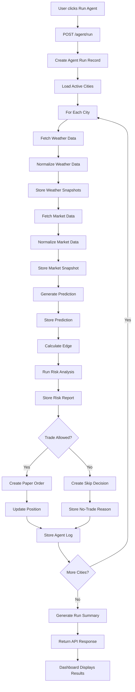
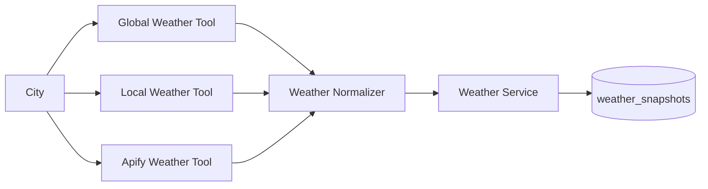
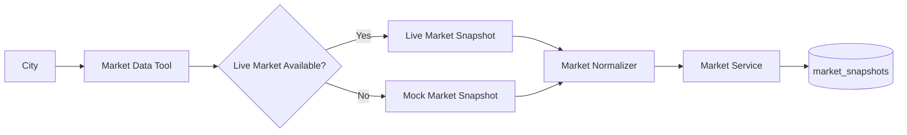
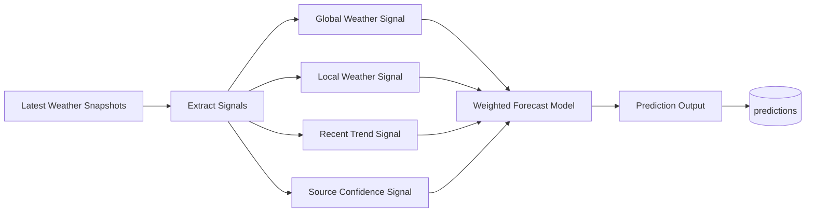
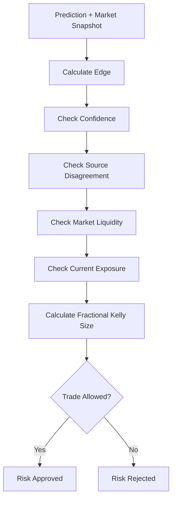
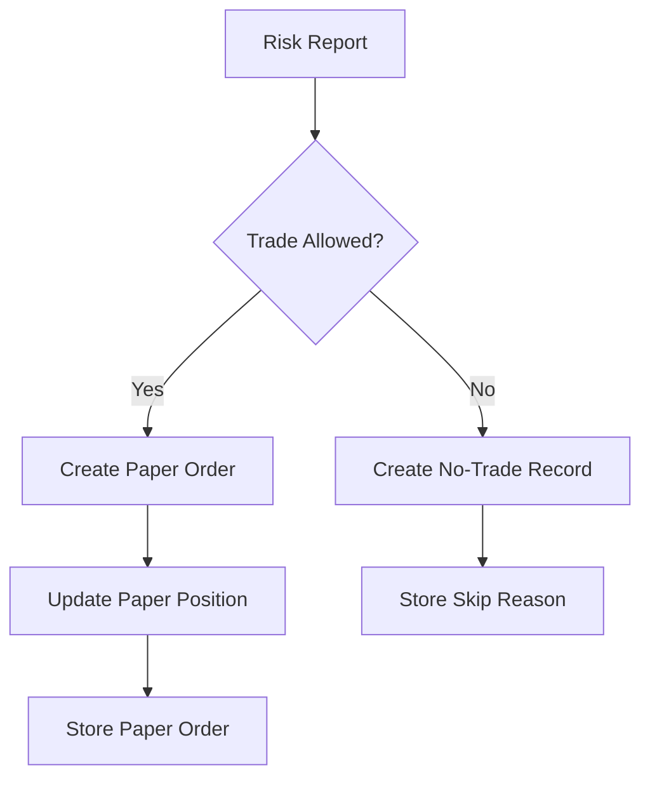
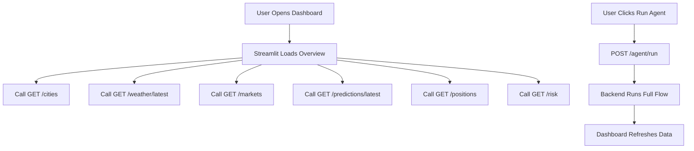
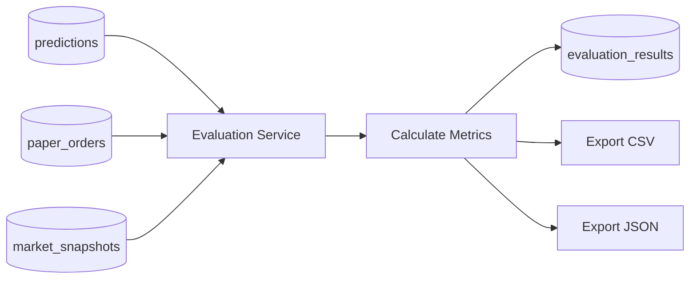

# 02 — System Flow

## 1. Purpose of This Document

This document explains the complete system flow for the Weather-Market Research Agent.

It defines what happens when the system runs from start to finish.

The goal is to make the project implementation clear before writing backend code.

This document covers:

* Full end-to-end agent run
* Per-city workflow
* Weather data flow
* Market data flow
* Prediction flow
* Edge calculation flow
* Risk management flow
* Paper trading flow
* Position update flow
* Evaluation flow
* Dashboard flow
* Error and fallback flow
* Logging flow

This document should be used as the implementation guide for the backend services and Hermes Agent orchestration.

---

## 2. System Flow Summary

The system takes weather data and market data, turns them into a prediction, compares that prediction with market probability, applies risk rules, and creates a paper trade decision.

High-level flow:

```txt id="vq9w27"
City
  ↓
Weather data refresh
  ↓
Market data refresh
  ↓
Prediction generation
  ↓
Market comparison
  ↓
Edge calculation
  ↓
Risk analysis
  ↓
Paper trade decision
  ↓
Position update
  ↓
Evaluation
  ↓
Dashboard display
```

The system should support running this flow for:

```txt id="dqmz6g"
A single city
All 5 MVP cities
```

For the MVP, the main demo path should run the full flow for all 5 cities using one API call.

---

## 3. Main Flow Trigger

The main system flow can be triggered from:

```txt id="7v1yje"
POST /agent/run
```

or from the Streamlit dashboard button:

```txt id="p0pe6y"
Run Agent
```

The dashboard should call the backend API.

Preferred trigger flow:

```txt id="d6zbar"
User clicks Run Agent
  ↓
Streamlit calls FastAPI
  ↓
FastAPI calls Hermes Agent service
  ↓
Hermes Agent runs tools
  ↓
Services save results
  ↓
Dashboard refreshes latest state
```

---

## 4. Complete End-to-End Flow



---

## 5. MVP Cities Flow

The MVP tracks 5 cities.

Default city list:

```txt id="jkwhc8"
Mumbai, India
London, United Kingdom
New York, United States
Tokyo, Japan
Sydney, Australia
```

At the beginning of a run, the system loads active cities from the database.

City loading flow:

```txt id="wz3w61"
1. Query cities table
2. Filter active cities
3. Validate that at least 5 cities exist
4. Process each city independently
```

If no cities exist, the system should seed default cities.

Fallback:

```txt id="goflk9"
If cities table is empty:
  create 5 default MVP cities
```

---

## 6. Per-City Flow

Each city follows the same workflow.

Per-city flow:

```txt id="8vbo8w"
1. Start city run
2. Fetch weather from global source
3. Fetch weather from local source
4. Fetch weather from Apify source
5. Normalize weather snapshots
6. Store weather snapshots
7. Fetch or mock market snapshot
8. Store market snapshot
9. Generate probability prediction
10. Compare prediction with market probability
11. Calculate edge
12. Run risk rules
13. Create paper order or no-trade decision
14. Update paper position if trade is created
15. Save logs and explanation
```

Each city should produce a final city-level result.

Example city-level result:

```json id="pku8vw"
{
  "city": "Mumbai",
  "status": "completed",
  "weather_sources_used": ["global", "local", "apify"],
  "market_source": "mock",
  "model_probability": 0.68,
  "market_probability": 0.42,
  "edge": 0.26,
  "risk_level": "medium",
  "decision": "paper_trade_created",
  "paper_order_id": 12
}
```

---

## 7. Weather Data Flow

Weather data is collected from multiple sources.

Sources:

```txt id="h9ngli"
Global weather source
Local or country-specific weather source
Apify weather scraper
```

Weather flow:



Detailed steps:

```txt id="d2pj69"
1. Receive city name and country
2. Call global weather tool
3. Call local weather tool
4. Call Apify weather tool
5. Convert each source response into common format
6. Assign source confidence
7. Store each normalized snapshot
8. Return latest weather bundle for the city
```

---

## 8. Weather Normalization Flow

Different weather sources may return different field names.

The normalizer converts them into one internal format.

Target format:

```json id="nt62yq"
{
  "city": "Mumbai",
  "country": "India",
  "date": "2026-06-28",
  "temperature": 30.5,
  "humidity": 82,
  "rain_probability": 0.74,
  "wind_speed": 12.1,
  "source": "apify",
  "source_confidence": 0.8
}
```

Normalization rules:

```txt id="k7ig37"
Temperature should be stored in Celsius
Humidity should be stored as percentage
Rain probability should be stored between 0 and 1
Wind speed should be stored in km/h or clearly documented unit
Source name must always be stored
Source confidence must always be stored
Missing values should be allowed but clearly marked
```

Example source confidence defaults:

```txt id="4zszjc"
global = 0.80
local = 0.85
apify = 0.75
mock = 0.50
```

---

## 9. Weather Source Failure Flow

The system should not fail because one weather source fails.

Failure rules:

```txt id="2kojug"
If one weather source fails:
  continue with remaining sources

If two weather sources fail:
  continue only if at least one reliable source remains

If all weather sources fail:
  skip prediction for that city

If source data is incomplete:
  store partial data and reduce confidence
```

Failure output example:

```json id="3re0op"
{
  "city": "Tokyo",
  "step": "weather_refresh",
  "status": "partial_success",
  "sources_successful": ["global", "apify"],
  "sources_failed": ["local"],
  "fallback_used": true
}
```

---

## 10. Market Data Flow

Market data gives the market-implied probability.

For MVP, the system can use:

```txt id="dth93k"
Live market data
Mock market data
Static sample market data
```

Market flow:



Detailed steps:

```txt id="00yp1s"
1. Search for weather market related to city
2. Read market question
3. Read yes price
4. Read no price
5. Calculate implied probability
6. Read volume and liquidity if available
7. Normalize market snapshot
8. Store market snapshot
```

---

## 11. Market Snapshot Format

Target market snapshot:

```json id="n6r4os"
{
  "market_id": "mock_mumbai_rain_001",
  "city": "Mumbai",
  "question": "Will it rain in Mumbai tomorrow?",
  "yes_price": 0.42,
  "no_price": 0.58,
  "implied_probability": 0.42,
  "volume": 12000,
  "liquidity": 5000,
  "end_date": "2026-06-29",
  "source_type": "mock"
}
```

Market probability rule:

```txt id="jazkvn"
For YES side:
  implied_probability = yes_price

For NO side:
  implied_probability = no_price
```

For MVP, focus mainly on YES-side weather outcomes such as:

```txt id="5el3w3"
Will it rain in Mumbai tomorrow?
Will London temperature exceed 25°C tomorrow?
Will New York receive measurable rain tomorrow?
```

---

## 12. Market Source Failure Flow

If live market data is unavailable, the system should generate mock market data.

Failure flow:

```txt id="hd40sw"
Try live market reader
  ↓
If successful, store live snapshot
  ↓
If failed, generate mock snapshot
  ↓
Store snapshot with source_type = mock
```

Mock market data should be realistic.

Example mock values:

```txt id="cfw3s1"
yes_price between 0.20 and 0.80
no_price = 1 - yes_price
volume between 1,000 and 50,000
liquidity between 500 and 20,000
```

Mock data must be clearly labeled in:

```txt id="naewfh"
Database
API response
Dashboard
README
```

---

## 13. Prediction Generation Flow

The prediction model converts weather signals into model probability.

Prediction flow:



Baseline formula:

```txt id="es60x0"
final_probability =
  45% global weather signal
+ 35% local weather signal
+ 10% recent trend
+ 10% source confidence
```

Prediction output:

```json id="a30h69"
{
  "city": "Mumbai",
  "model_probability": 0.68,
  "confidence": 0.74,
  "reason": "Local and global weather sources agree on high rainfall probability."
}
```

---

## 14. Prediction Input Flow

For each city, the prediction service loads:

```txt id="p0bxsq"
Latest global weather snapshot
Latest local weather snapshot
Latest Apify weather snapshot
Recent previous weather snapshots
Latest market snapshot
```

The market snapshot is not required to calculate weather probability, but it is required for edge comparison.

Weather prediction should be generated before trade decision.

---

## 15. Prediction Confidence Flow

Prediction confidence should depend on:

```txt id="b2r5n0"
Number of available weather sources
Agreement between sources
Source confidence values
Freshness of data
Completeness of data
```

Simple confidence logic:

```txt id="zvycet"
Start confidence = average source confidence

If all 3 sources available:
  add small bonus

If sources strongly agree:
  add small bonus

If data is stale:
  reduce confidence

If sources disagree strongly:
  reduce confidence

Clamp final confidence between 0 and 1
```

Example:

```json id="s6ye50"
{
  "city": "London",
  "available_sources": 3,
  "source_agreement": 0.82,
  "data_freshness": "fresh",
  "confidence": 0.76
}
```

---

## 16. Edge Calculation Flow

Edge measures the difference between model probability and market probability.

Formula:

```txt id="wfa6cb"
edge = model_probability - market_probability
```

Interpretation:

```txt id="6fy62c"
Positive edge:
  Model thinks YES is more likely than market price suggests

Negative edge:
  Model thinks YES is less likely than market price suggests

Near-zero edge:
  No meaningful difference between model and market
```

Example:

```txt id="6zlfld"
Model probability = 0.68
Market probability = 0.42

Edge = 0.68 - 0.42 = 0.26
```

Trade direction:

```txt id="tkdgae"
If edge > minimum_edge:
  consider YES paper trade

If edge < -minimum_edge:
  consider NO paper trade

If edge is small:
  no trade
```

For MVP, use conservative threshold:

```txt id="hgx86z"
minimum_edge = 0.05
```

---

## 17. Risk Analysis Flow

Risk management decides whether a paper trade is allowed and how large it should be.

Risk flow:



Risk rules:

```txt id="bgx9oz"
No trade if confidence < 0.60
No trade if absolute edge < 0.05
No trade if source disagreement is high
No trade if total exposure would exceed 10%
Max 2% bankroll risk per trade
Reduce size if liquidity is low
Use fractional Kelly only
```

---

## 18. Risk Report Output

The risk service should create a risk report for every prediction.

Example approved risk report:

```json id="3cttpo"
{
  "city": "Mumbai",
  "model_probability": 0.68,
  "market_probability": 0.42,
  "edge": 0.26,
  "confidence": 0.74,
  "risk_level": "medium",
  "trade_allowed": true,
  "recommended_side": "YES",
  "recommended_size": 15.0,
  "reason": "Positive edge with acceptable confidence and exposure."
}
```

Example rejected risk report:

```json id="q2aj8l"
{
  "city": "Tokyo",
  "model_probability": 0.51,
  "market_probability": 0.49,
  "edge": 0.02,
  "confidence": 0.71,
  "risk_level": "low",
  "trade_allowed": false,
  "recommended_side": "NONE",
  "recommended_size": 0,
  "reason": "Edge is below minimum threshold."
}
```

---

## 19. Paper Trading Flow

Paper trading simulates a trade decision.

It never creates a non-paper order.

Paper trading flow:



Paper order output:

```json id="emtm8n"
{
  "city": "London",
  "side": "YES",
  "simulated_price": 0.42,
  "size": 15.0,
  "model_probability": 0.58,
  "market_probability": 0.42,
  "edge": 0.16,
  "risk_level": "medium",
  "status": "paper_order_created"
}
```

Paper trading rules:

```txt id="y47pmp"
Only write local audit records
Never call non-paper placement APIs
Never use signing credentials
Never use funded accounts
Never use non-paper funds
Always label order as paper order
```

---

## 20. Position Update Flow

When a paper trade is created, the system updates the simulated position.

Position update flow:

```txt id="3sq89k"
1. Check if position exists for market/city/side
2. If position exists, update size and average entry price
3. If no position exists, create new position
4. Update total exposure
5. Store timestamp
```

Position output example:

```json id="0vf1gg"
{
  "city": "London",
  "market_id": "mock_london_temp_001",
  "side": "YES",
  "total_size": 25.0,
  "average_price": 0.44,
  "current_market_price": 0.47,
  "unrealized_pnl": 1.75,
  "status": "open"
}
```

---

## 21. Agent Logging Flow

Each full run should create an agent run record.

Each city should create step-level logs.

Run-level log:

```json id="1hotct"
{
  "agent_run_id": 1,
  "started_at": "2026-06-28T10:00:00Z",
  "finished_at": "2026-06-28T10:00:20Z",
  "status": "completed",
  "cities_processed": 5,
  "paper_orders_created": 3,
  "paper_orders_skipped": 2
}
```

Step-level log:

```json id="uo6kqv"
{
  "agent_run_id": 1,
  "city": "Mumbai",
  "step_name": "prediction_generation",
  "status": "success",
  "message": "Generated model probability 0.68 with confidence 0.74.",
  "fallback_used": false
}
```

Failed step log:

```json id="lvk9r6"
{
  "agent_run_id": 1,
  "city": "Tokyo",
  "step_name": "local_weather_fetch",
  "status": "failed",
  "message": "Local source unavailable. Continued with global and Apify sources.",
  "fallback_used": true
}
```

---

## 22. Dashboard Flow

The dashboard should not contain core trading logic.

Dashboard flow:



Dashboard pages:

```txt id="99qshr"
Overview
City Detail
Predictions
Paper Trades
Risk Dashboard
Results
```

Overview should display:

```txt id="965a7o"
City
Market probability
Model probability
Edge
Confidence
Risk level
Paper position
Latest decision
Data source type
```

---

## 23. Evaluation Flow

Evaluation should run after predictions and paper trades exist.

Evaluation flow:



Evaluation inputs:

```txt id="d6s3qu"
Predictions
Market snapshots
Paper orders
Positions
Resolved outcomes or simulated outcomes
```

Evaluation outputs:

```txt id="xig17p"
Prediction accuracy
Brier score
Log loss
Mean absolute error
Simulated PnL
Win rate
Max drawdown
Average confidence
Average edge
```

Demo output files:

```txt id="6cg2g5"
demo_output/results_summary.csv
demo_output/sample_predictions.json
demo_output/sample_orders.json
```

---

## 24. Evaluation Outcome Flow

For MVP, not all markets may have real resolved outcomes.

Outcome handling:

```txt id="6sxqhs"
If real outcome is available:
  use real outcome

If real outcome is unavailable:
  use simulated outcome for demo

If outcome is missing:
  exclude record from outcome-based metrics
```

Outcome labels:

```txt id="dne5x5"
1 = event happened
0 = event did not happen
```

Example:

```json id="7nwpzd"
{
  "city": "Mumbai",
  "question": "Will it rain in Mumbai tomorrow?",
  "model_probability": 0.68,
  "actual_outcome": 1,
  "brier_score": 0.1024
}
```

---

## 25. API Flow Summary

Main API flow for demo:

```txt id="pmmfl7"
GET /health
GET /cities
POST /weather/refresh
POST /markets/refresh
POST /predictions/generate
POST /paper-trades/run
POST /evaluation/run
```

Main one-click agent flow:

```txt id="y672wv"
POST /agent/run
```

The one-click flow should internally perform:

```txt id="iwc4nq"
weather refresh
market refresh
prediction generation
risk analysis
paper trading
logging
summary response
```

---

## 26. Expected Agent Run Response

`POST /agent/run` should return a summary.

Example:

```json id="c1dorc"
{
  "agent_run_id": 7,
  "status": "completed",
  "cities_processed": 5,
  "weather_snapshots_created": 15,
  "market_snapshots_created": 5,
  "predictions_created": 5,
  "risk_reports_created": 5,
  "paper_orders_created": 3,
  "paper_orders_skipped": 2,
  "summary": [
    {
      "city": "Mumbai",
      "decision": "paper_trade_created",
      "side": "YES",
      "edge": 0.26,
      "risk_level": "medium"
    },
    {
      "city": "Tokyo",
      "decision": "skipped",
      "side": "NONE",
      "edge": 0.02,
      "risk_level": "low"
    }
  ]
}
```

---

## 27. Successful Run Definition

A successful full run means:

```txt id="b8rjg7"
At least 5 cities are processed
Weather data exists for each city
Market snapshot exists for each city
Prediction exists for each city
Risk report exists for each city
Paper trade or skip decision exists for each city
Agent log exists for each city
Dashboard can display latest results
```

Not every city needs a paper trade.

A skipped trade is still a valid decision if the risk report explains why.

---

## 28. Partial Run Definition

A partial run means some cities or sources failed, but the system continued.

Example partial run:

```txt id="5zohbe"
5 cities loaded
4 cities completed
1 city skipped due to no weather data
3 paper orders created
1 no-trade decision
1 city failure logged
```

Partial runs should still return useful output.

The system should not crash the entire agent run because of one city failure.

---

## 29. Error Handling Flow

General error flow:

```txt id="791c60"
Try step
  ↓
If success, continue
  ↓
If failure is recoverable, use fallback
  ↓
If fallback succeeds, continue and log fallback
  ↓
If failure is unrecoverable, skip city and log failure
```

Recoverable errors:

```txt id="x3u2y6"
One weather source fails
Live market data unavailable
OpenRouter explanation unavailable
Missing optional field
Low liquidity
```

Unrecoverable errors:

```txt id="e6q5b9"
No city data
No weather data from any source
Database unavailable
Invalid configuration
Prediction cannot be generated
```

---

## 30. Fallback Flow

Fallback behavior:

| Failed Component           | Fallback                                  |
| -------------------------- | ----------------------------------------- |
| Global weather source      | Use local + Apify                         |
| Local weather source       | Use global + Apify                        |
| Apify source               | Use global + local                        |
| Live market data           | Use mock market data                      |
| OpenRouter explanation     | Use deterministic template explanation    |
| Evaluation outcome missing | Skip outcome-based metric for that record |

Fallbacks should always be logged.

---

## 31. Data Storage Flow

Every major step should store output.

Storage mapping:

| Step                  | Table              |
| --------------------- | ------------------ |
| City seed/load        | cities             |
| Weather refresh       | weather_snapshots  |
| Market refresh        | market_snapshots   |
| Prediction generation | predictions        |
| Risk analysis         | risk_reports       |
| Paper trade decision  | paper_orders       |
| Position update       | positions          |
| Evaluation            | evaluation_results |
| Agent execution       | agent_run_logs     |

This ensures prior predictions and previous decisions can be shown later.

---

## 32. Prior Predictions Flow

The assignment expects prior predictions to be visible.

Prior prediction flow:

```txt id="z6p74s"
1. Store every generated prediction
2. Do not overwrite old predictions
3. Mark latest prediction using timestamp
4. Dashboard shows latest prediction by default
5. City detail page shows prediction history
```

Prediction history should include:

```txt id="24fcna"
Timestamp
City
Question
Model probability
Market probability
Edge
Confidence
Decision
Outcome if available
```

---

## 33. Risk Dashboard Flow

The risk dashboard reads from:

```txt id="5x6i4d"
risk_reports
positions
paper_orders
market_snapshots
```

It should show:

```txt id="8fz4b5"
Total simulated bankroll
Total exposure
Exposure by city
Exposure by side
Max trade risk used
Risk level distribution
Skipped trade reasons
Largest paper position
```

This makes the risk logic visible and easy to explain.

---

## 34. Results Reporting Flow

Results should be generated through:

```txt id="6el0oh"
POST /evaluation/run
```

The evaluator should:

```txt id="vqxk6f"
Read stored predictions
Read stored paper trades
Read outcomes or simulated outcomes
Calculate metrics
Store results
Export CSV and JSON examples
```

The final README and demo should reference generated output files.

---

## 35. Demo Flow

The ideal video demo flow:

```txt id="lyy0zo"
1. Show README and architecture briefly
2. Start backend
3. Open /health
4. Start Streamlit dashboard
5. Show 5 tracked cities
6. Click Run Agent
7. Show weather data refreshed
8. Show market probabilities
9. Show model probabilities
10. Show edge and risk levels
11. Show paper orders and skipped trades
12. Show positions
13. Run evaluation
14. Show metrics and output files
```

The demo should clearly say:

```txt id="8paeos"
This is a paper-trading simulation.
No non-paper trades are created.
```

---

## 36. Implementation Order Based on Flow

Implementation should follow the system flow order:

```txt id="uljlll"
1. Seed cities
2. Build weather refresh
3. Build market refresh or mock market generator
4. Build prediction generation
5. Build risk analysis
6. Build paper order creation
7. Build position update
8. Build agent orchestration
9. Build dashboard display
10. Build evaluation
```

This keeps the project practical and avoids building UI or agents before the core data flow works.

---

## 37. Minimum Working Flow

The minimum working system must support:

```txt id="hkcl8r"
POST /agent/run
```

and return:

```txt id="46zbkg"
5 city results
5 weather bundles
5 market snapshots
5 predictions
5 risk reports
At least one paper trade or clear no-trade decisions
```

Even with mocked market data, this proves the core system works.

---

## 38. Flow Acceptance Checklist

This system flow is complete when:

```txt id="6bgsns"
The full run starts from POST /agent/run
The system loads 5 active cities
Weather data is fetched and normalized
Market data is fetched or mocked
Predictions are generated
Edges are calculated
Risk reports are created
Paper orders or skip decisions are created
Positions are updated when needed
Agent logs are saved
Dashboard can display latest state
Evaluation can run from stored records
Fallbacks are logged
No real-money trade path exists
```

---

## 39. 60-Second System Flow Explanation

The system starts when the user clicks “Run Agent” in the dashboard or calls `POST /agent/run`.

The backend loads 5 active cities. For each city, it fetches global, local, and Apify weather data, normalizes the data, and stores weather snapshots. It then reads live or mock prediction market data and stores the market-implied probability.

Next, the prediction service generates a model probability using an explainable weighted formula. The system compares this model probability with the market probability to calculate edge. The risk service checks confidence, source agreement, liquidity, current exposure, and fractional Kelly sizing.

If the risk rules approve the trade, the paper trading service creates a simulated paper order and updates the paper position. If the risk rules reject the trade, the system stores a no-trade decision with the reason.

All decisions are saved to the database. The dashboard displays weather signals, predictions, market probabilities, edge, risk levels, paper orders, positions, prior predictions, and evaluation results.

---

## Resource-Informed End-to-End Flow

The resource-informed MVP flow is:

1. User selects city/market.
2. System fetches weather data from Open-Meteo, local source, and/or Apify.
3. System normalizes weather data into the internal schema.
4. System fetches Polymarket price and order book using `polymarket-paper-trader`.
5. System calculates model probability for the specific Polymarket contract outcome.
6. System calculates market-implied probability from midpoint/order-book data.
7. System calculates edge and tradeable_edge.
8. Risk manager decides `NO_TRADE`, `WATCH`, or paper-trade action.
9. Hermes agent generates an evidence-based explanation.
10. Paper execution is recorded through `pm-trader` only if risk allows it.
11. Local DB stores audit mirror records.
12. Dashboard shows market, model, edge, risk, and paper P&L.

This flow models the market contract rather than only the real-world weather event.
