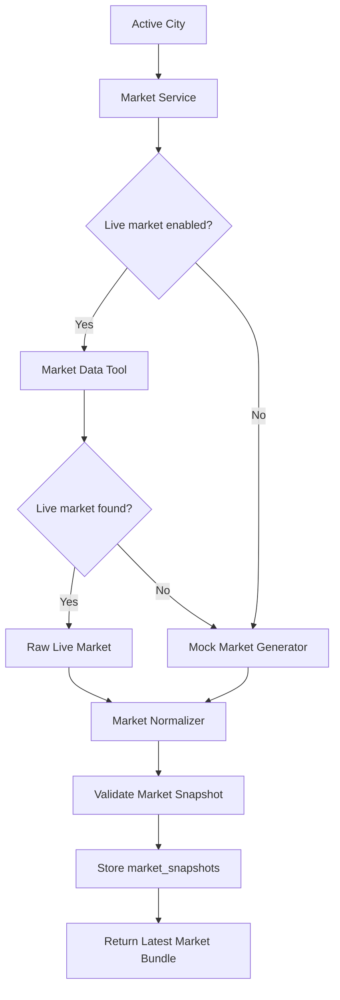

# 06 — Market Data Design

## 1. Purpose of This Document

This document defines the market data design for the Weather-Market Research Agent.

The system needs market data because predictions only become useful when compared against market-implied probabilities.

This document explains:

```txt id="szwq4s"
Market data role in the system
Live market data strategy
Mock market data strategy
Market snapshot format
Market normalization rules
Implied probability calculation
Market freshness rules
Market fallback behavior
Market storage rules
How market data connects to prediction, risk, and paper trading
```

This document should be used when implementing:

```txt id="gw3c3p"
app/tools/market_data_tool.py
app/tools/market_normalizer.py
app/services/market_service.py
app/services/prediction_service.py
app/services/risk_service.py
app/services/paper_trading_service.py
```

---

## 2. Market Data Role in the System

Market data represents what the prediction market currently believes about a weather event.

The prediction model estimates the probability of a weather event.

The market provides the price/implied probability.

The system compares both values.

Flow:

```txt id="2j2sbo"
Weather Data
  ↓
Model Probability
  ↓
Market Data
  ↓
Market-Implied Probability
  ↓
Edge Calculation
  ↓
Risk Management
  ↓
Paper Trade Decision
```

The market data layer does not place trades.

It only reads or generates market snapshots.

---

## 3. Core Market Data Concept

For a binary prediction market, prices can be interpreted as probabilities.

Example:

```txt id="0j8iaj"
Market question:
Will it rain in Mumbai tomorrow?

YES price:
0.42

Market-implied YES probability:
42%
```

If the model estimates:

```txt id="hv1ola"
Model probability = 0.68
Market probability = 0.42
```

Then:

```txt id="xw5t5e"
Edge = 0.68 - 0.42 = 0.26
```

This means the model thinks the event is more likely than the market suggests.

The risk engine then decides whether this edge is large and reliable enough for a paper trade.

---

## 4. MVP Market Data Strategy

The MVP supports two market modes:

```txt id="z3s9cl"
1. Live market data mode
2. Mock market data mode
```

### 4.1 Live Market Data Mode

Live market data mode attempts to read real prediction market information.

This is preferred if integration is simple and reliable.

Live mode should be read-only.

It should not place orders.

It should not require signing credentials.

It should not sign transactions.

---

### 4.2 Mock Market Data Mode

Mock market data mode creates realistic simulated market snapshots.

This is acceptable for MVP because the assignment is about building a working agent system with paper trading.

Mock market data ensures the full system can run even if live market integration takes too long.

Mock data must be clearly labeled everywhere.

Required labels:

```txt id="xfpqlg"
source_type = mock
source_name = mock_market_generator
```

---

## 5. Market Data Safety Boundary

The market data layer must be read-only.

Allowed:

```txt id="ywpeco"
Read market questions
Read YES price
Read NO price
Read volume
Read liquidity
Read end date
Store market snapshots
Generate mock snapshots
```

Not allowed in MVP:

```txt id="9jg0wy"
Submit non-paper orders
Connect funded account
Store signing credentials
Sign transactions
Submit orders to a real market
Use real funds
```

The system must remain a paper-trading simulation.

---

## 6. Market Data Flow



---

## 7. Market Data Tool

### Expected File

```txt id="adqcn5"
app/tools/market_data_tool.py
```

### Purpose

The market data tool is responsible for getting market information for a city.

It can either:

```txt id="vp5gqx"
Fetch live market data
Generate mock market data
Load static sample market data
```

### Recommended Interface

```python id="kl2bvp"
def fetch_market_for_city(city: CityRead, force_mock: bool = False) -> RawMarketResult:
    ...
```

### Input

```json id="jq8jqo"
{
  "city": "Mumbai",
  "country": "India",
  "outcome_type": "rain",
  "force_mock": false
}
```

### Raw Output Shape

```json id="s4e645"
{
  "city": "Mumbai",
  "country": "India",
  "source_type": "mock",
  "source_name": "mock_market_generator",
  "status": "success",
  "raw_payload": {
    "market_id": "mock_mumbai_rain_001",
    "question": "Will it rain in Mumbai tomorrow?",
    "yes_price": 0.42,
    "no_price": 0.58,
    "volume": 12000,
    "liquidity": 5000,
    "end_date": "2026-06-29T23:59:00Z"
  },
  "error_message": null,
  "fetched_at": "2026-06-28T10:00:00Z"
}
```

---

## 8. Market Normalizer

### Expected File

```txt id="gny939"
app/tools/market_normalizer.py
```

### Purpose

The market normalizer converts raw market data into the internal market snapshot schema.

It handles:

```txt id="bw2agb"
Different source field names
Missing volume/liquidity fields
Mock market format
Implied probability calculation
Data validation
Source labeling
Raw payload storage
```

### Input

```json id="2szxp5"
{
  "source_type": "mock",
  "source_name": "mock_market_generator",
  "raw_payload": {
    "market_id": "mock_mumbai_rain_001",
    "question": "Will it rain in Mumbai tomorrow?",
    "yes_price": 0.42,
    "no_price": 0.58,
    "volume": 12000,
    "liquidity": 5000
  }
}
```

### Output

```json id="g1l0w4"
{
  "city": "Mumbai",
  "market_id": "mock_mumbai_rain_001",
  "question": "Will it rain in Mumbai tomorrow?",
  "outcome_type": "rain",
  "target_value": null,
  "target_unit": null,
  "yes_price": 0.42,
  "no_price": 0.58,
  "implied_probability": 0.42,
  "volume": 12000,
  "liquidity": 5000,
  "source_type": "mock",
  "source_name": "mock_market_generator",
  "status": "success"
}
```

---

## 9. Normalized Market Snapshot Schema

All market data should be normalized into this structure:

```json id="z788h6"
{
  "city": "Mumbai",
  "country": "India",
  "market_id": "mock_mumbai_rain_001",
  "question": "Will it rain in Mumbai tomorrow?",
  "outcome_type": "rain",
  "target_value": null,
  "target_unit": null,
  "yes_price": 0.42,
  "no_price": 0.58,
  "implied_probability": 0.42,
  "volume": 12000,
  "liquidity": 5000,
  "end_date": "2026-06-29T23:59:00Z",
  "source_type": "mock",
  "source_name": "mock_market_generator",
  "raw_payload": {},
  "fetched_at": "2026-06-28T10:00:00Z"
}
```

This schema maps directly to the `market_snapshots` table.

---

## 10. Market Snapshot Fields

| Field               | Purpose                                       |
| ------------------- | --------------------------------------------- |
| city                | City name                                     |
| country             | Country name                                  |
| market_id           | Unique market identifier                      |
| question            | Human-readable market question                |
| outcome_type        | Type of weather event                         |
| target_value        | Threshold value if market asks about a number |
| target_unit         | Unit for target value                         |
| yes_price           | YES outcome price                             |
| no_price            | NO outcome price                              |
| implied_probability | Market-implied YES probability                |
| volume              | Market volume                                 |
| liquidity           | Available liquidity                           |
| end_date            | Market close/resolution date                  |
| source_type         | live, mock, or static                         |
| source_name         | Specific source/tool name                     |
| raw_payload         | Original response                             |
| fetched_at          | Time market data was fetched                  |

---

## 11. Outcome Types

Supported MVP outcome types:

```txt id="hxa68z"
rain
temperature
wind
humidity
other
```

Recommended MVP focus:

```txt id="domugw"
rain
```

Reason:

```txt id="7h5qa3"
Rain probability is easy to connect with weather APIs and easy to explain in a demo.
```

Examples:

```txt id="t8eal9"
Will it rain in Mumbai tomorrow?
Will it rain in London tomorrow?
Will it rain in New York tomorrow?
Will it rain in Tokyo tomorrow?
Will it rain in Sydney tomorrow?
```

Temperature markets can be added later.

---

## 12. Market Question Design

For MVP mock markets, use simple binary questions.

Recommended format:

```txt id="79omso"
Will it rain in {city} tomorrow?
```

Examples:

```txt id="wvnh96"
Will it rain in Mumbai tomorrow?
Will it rain in London tomorrow?
Will it rain in New York tomorrow?
Will it rain in Tokyo tomorrow?
Will it rain in Sydney tomorrow?
```

These questions align directly with the weather pipeline's `rain_probability` field.

---

## 13. Implied Probability Calculation

For the MVP, implied probability is simple:

```txt id="8vxi3x"
implied_probability = yes_price
```

Example:

```txt id="gn9qeu"
yes_price = 0.42
implied_probability = 0.42
```

NO price:

```txt id="pkro01"
no_price = 1 - yes_price
```

Example:

```txt id="c8vba1"
yes_price = 0.42
no_price = 0.58
```

For more advanced versions, the system can account for market spread, fees, and order book depth.

MVP decision:

```txt id="t1fj6c"
Use yes_price directly as market-implied YES probability.
```

---

## 14. Price Validation Rules

Market prices must be valid probabilities.

Validation:

```txt id="0bduot"
0 <= yes_price <= 1
0 <= no_price <= 1
0 <= implied_probability <= 1
```

For binary markets:

```txt id="d6zo9l"
yes_price + no_price should be approximately 1
```

Allowed tolerance:

```txt id="qvgv9z"
0.05
```

If prices are invalid:

```txt id="suv26c"
Reject snapshot
Log error
Use mock fallback if enabled
```

---

## 15. Volume and Liquidity Rules

Volume and liquidity are used by the risk model.

They help decide whether to reduce size or block a trade.

Fields:

```txt id="5d6af6"
volume
liquidity
```

Validation:

```txt id="m7z6w2"
volume >= 0
liquidity >= 0
```

If missing:

```txt id="kpullw"
Set volume = 0
Set liquidity = 0
Mark liquidity confidence as low
Risk model should reduce size or block trade
```

Suggested liquidity bands:

```txt id="rmg58h"
liquidity >= 10000 → good
liquidity >= 2500  → medium
liquidity < 2500   → low
```

MVP risk behavior:

```txt id="gcorl7"
Good liquidity → no size reduction
Medium liquidity → moderate size reduction
Low liquidity → strong size reduction or no trade
```

---

## 16. Market Freshness Rules

Market snapshots should be fresh before prediction and trading.

Suggested freshness rules:

```txt id="1zgdsv"
Fresh: fetched within last 1 hour
Acceptable: fetched within last 6 hours
Stale: older than 6 hours
```

For MVP:

```txt id="wpcsgt"
Always refresh markets inside POST /agent/run.
```

If market data is stale:

```txt id="g5nrjs"
Refresh market snapshot
If refresh fails, use mock fallback if enabled
Log stale market warning
```

---

## 17. Market Service

### Expected File

```txt id="ghf17r"
app/services/market_service.py
```

### Responsibilities

The market service coordinates market tools and database storage.

Responsibilities:

```txt id="fzmhdr"
Load selected cities
Fetch live or mock market data
Normalize market data
Validate market snapshot
Store market snapshots
Return latest market data
Log fallback usage
```

### Recommended Function

```python id="xvkb8k"
def refresh_markets(
    city_ids: list[int] | None = None,
    use_mock_if_live_unavailable: bool = True,
    force_mock: bool = False
) -> MarketRefreshSummary:
    ...
```

---

## 18. Market Refresh Flow

Detailed flow:

```txt id="ro79u6"
1. Load selected active cities
2. For each city:
   1. Try live market data if force_mock is false
   2. If live market succeeds, normalize and store it
   3. If live market fails and fallback is enabled, generate mock market
   4. Normalize mock market
   5. Validate snapshot
   6. Store market snapshot
   7. Log source type
3. Return refresh summary
```

---

## 19. Market Refresh API

Endpoint:

```txt id="9wfns6"
POST /markets/refresh
```

Request:

```json id="juhhf9"
{
  "city_ids": [1, 2, 3, 4, 5],
  "use_mock_if_live_unavailable": true,
  "force_mock": false
}
```

Response:

```json id="mtsmxu"
{
  "success": true,
  "message": "Market refresh completed.",
  "data": {
    "cities_processed": 5,
    "market_snapshots_created": 5,
    "live_snapshots": 0,
    "mock_snapshots": 5,
    "fallback_used": true
  }
}
```

---

## 20. Latest Markets API

Endpoint:

```txt id="eicm6e"
GET /markets
```

Purpose:

```txt id="y5bobu"
Return latest market snapshots for dashboard, prediction comparison, and risk analysis.
```

Example response:

```json id="q42t8t"
[
  {
    "id": 1,
    "city_id": 1,
    "city_name": "Mumbai",
    "market_id": "mock_mumbai_rain_001",
    "question": "Will it rain in Mumbai tomorrow?",
    "outcome_type": "rain",
    "target_value": null,
    "target_unit": null,
    "yes_price": 0.42,
    "no_price": 0.58,
    "implied_probability": 0.42,
    "volume": 12000,
    "liquidity": 5000,
    "end_date": "2026-06-29T23:59:00Z",
    "source_type": "mock",
    "source_name": "mock_market_generator",
    "fetched_at": "2026-06-28T10:00:00Z"
  }
]
```

---

## 21. Mock Market Generator

### Purpose

The mock market generator creates realistic market snapshots for each city when live data is unavailable.

### Expected Behavior

For each city, generate:

```txt id="jrdrzi"
market_id
question
yes_price
no_price
implied_probability
volume
liquidity
end_date
source_type
source_name
```

### Recommended Mock Logic

Use city and weather context where possible.

Option 1 — Simple random mock:

```txt id="a39ala"
yes_price between 0.20 and 0.80
no_price = 1 - yes_price
volume between 1,000 and 50,000
liquidity between 500 and 20,000
```

Option 2 — Weather-aware mock:

```txt id="8mya1x"
Use latest rain probability as center
Add small random market noise
Clamp price between 0.20 and 0.80
```

Recommended MVP approach:

```txt id="hcglrw"
Use weather-aware mock if weather data exists.
Use simple random mock if weather data is missing.
```

---

## 22. Weather-Aware Mock Market Example

If latest weather rain probability is:

```txt id="kazjbj"
0.68
```

Then market price can be generated as:

```txt id="z90bat"
yes_price = rain_probability - random_noise
```

Example:

```txt id="o0scms"
rain_probability = 0.68
random_noise = 0.14
yes_price = 0.54
```

Then:

```txt id="7t0cfo"
no_price = 0.46
implied_probability = 0.54
```

This creates realistic but not identical market probabilities.

Important:

```txt id="kllxa7"
Mock market data should not always match the model.
Some cities should show positive edge.
Some cities should show weak or no edge.
This helps demonstrate risk decisions and skipped trades.
```

---

## 23. Mock Market Output Example

```json id="cuxt0q"
{
  "city": "Mumbai",
  "country": "India",
  "market_id": "mock_mumbai_rain_20260629",
  "question": "Will it rain in Mumbai tomorrow?",
  "outcome_type": "rain",
  "target_value": null,
  "target_unit": null,
  "yes_price": 0.42,
  "no_price": 0.58,
  "implied_probability": 0.42,
  "volume": 12000,
  "liquidity": 5000,
  "end_date": "2026-06-29T23:59:00Z",
  "source_type": "mock",
  "source_name": "mock_market_generator"
}
```

---

## 24. Market Snapshot Storage Rules

Store every market snapshot.

Do not overwrite old market snapshots.

Reason:

```txt id="12zv0j"
Prior predictions need market context.
Risk reports need the market probability at decision time.
Evaluation needs historical price snapshots.
Dashboard can show market history.
```

Storage fields:

```txt id="puh2ma"
city_id
city_name
market_id
question
outcome_type
target_value
target_unit
yes_price
no_price
implied_probability
volume
liquidity
end_date
source_type
source_name
raw_payload
fetched_at
created_at
```

---

## 25. Relationship with Predictions

Each prediction should link to a market snapshot.

Relationship:

```txt id="p5kkja"
market_snapshots.id → predictions.market_snapshot_id
```

Reason:

```txt id="si3r11"
The model probability must be compared with the exact market probability available at that time.
```

Example:

```txt id="1otgx8"
market_snapshot.implied_probability = 0.42
prediction.model_probability = 0.68
edge = 0.26
```

This edge becomes input to the risk report.

---

## 26. Relationship with Risk Reports

Each risk report should link to:

```txt id="tc8g41"
prediction_id
market_snapshot_id
```

Risk input values:

```txt id="ezyh1s"
model_probability
market_probability
edge
confidence
volume
liquidity
current exposure
```

Risk service reads:

```txt id="wvj8rg"
latest prediction
linked market snapshot
current positions
```

Then decides:

```txt id="2eacv5"
trade_allowed
recommended_side
recommended_size
risk_level
reason
```

---

## 27. Relationship with Paper Orders

Each paper order should link to:

```txt id="fmpbsh"
risk_report_id
prediction_id
market_snapshot_id
market_id
```

Paper order copies important values:

```txt id="yms1ic"
simulated_price
model_probability
market_probability
edge
risk_level
side
size
reason
```

Reason:

```txt id="4l9tjw"
The order record should remain understandable even if market snapshot data changes later.
```

---

## 28. Market Data and Edge Calculation

Edge calculation:

```txt id="02yyq7"
edge = model_probability - market_probability
```

For YES side:

```txt id="a2n3sm"
market_probability = yes_price
```

For NO side:

```txt id="988shc"
market_probability = no_price
```

MVP decision:

```txt id="tpo0b6"
Start by calculating YES edge.
Optionally allow NO edge if model probability is much lower than market probability.
```

YES edge:

```txt id="3gi7jz"
yes_edge = model_probability - yes_price
```

NO edge:

```txt id="l5v3e9"
no_edge = (1 - model_probability) - no_price
```

Trade direction:

```txt id="wgtrn5"
If yes_edge > minimum_edge:
  recommend YES

If no_edge > minimum_edge:
  recommend NO

Otherwise:
  recommend NONE
```

---

## 29. Minimum Edge Rule

The risk model should ignore tiny edges.

Suggested MVP threshold:

```txt id="350anc"
minimum_edge = 0.05
```

Example:

```txt id="rhfi3h"
model_probability = 0.54
market_probability = 0.51
edge = 0.03

Decision:
No trade because edge is too small.
```

---

## 30. Market Liquidity and Risk

Market liquidity affects paper trade size.

Liquidity adjustment:

```txt id="u46j0m"
If liquidity >= 10000:
  liquidity_adjustment = 1.0

If liquidity >= 2500 and liquidity < 10000:
  liquidity_adjustment = 0.5

If liquidity < 2500:
  liquidity_adjustment = 0.25 or block trade
```

Risk service should explain this.

Example:

```json id="prqnlg"
{
  "city": "London",
  "liquidity": 1800,
  "liquidity_band": "low",
  "liquidity_adjustment": 0.25,
  "reason": "Trade size reduced due to low market liquidity."
}
```

---

## 31. Live Market Data Implementation Plan

For MVP, live market integration is optional.

Suggested implementation order:

```txt id="z4dgd4"
1. Build mock market generator first
2. Build market normalizer
3. Store market snapshots
4. Connect predictions and risk to market snapshots
5. Add live market reader only if time remains
```

Reason:

```txt id="ltq3s7"
The full project can be demonstrated with mock market data, but cannot be demonstrated without working market snapshots.
```

---

## 32. Live Market Search Strategy

If live market data is implemented, search by city and weather keyword.

Search terms:

```txt id="h8ulax"
Mumbai rain
London rain
New York rain
Tokyo rain
Sydney rain
weather
temperature
rainfall
```

The system should match markets based on:

```txt id="lm059w"
City name
Weather term
Question text
End date
Binary YES/NO structure
```

If no suitable live market exists:

```txt id="72ynhp"
Use mock market fallback
```

---

## 33. Market Match Scoring

If multiple markets are found, score them.

Suggested scoring:

```txt id="i4hz1b"
+0.40 if question contains city name
+0.30 if question contains rain/weather/temperature keyword
+0.20 if market is active
+0.10 if volume/liquidity is available
```

Select the highest-scoring market.

Minimum acceptable score:

```txt id="qnj4aq"
0.60
```

If no market reaches minimum score:

```txt id="cw7yim"
Use mock fallback
```

---

## 34. Market Data Failure Handling

Failure behavior:

```txt id="hjxfah"
If live market API fails:
  log failure
  use mock market if enabled

If market response has invalid prices:
  reject snapshot
  use mock fallback

If no matching market found:
  use mock fallback

If mock generation fails:
  mark city market refresh as failed
```

The system should continue processing other cities.

---

## 35. Market Run Summary

After market refresh, return a summary.

Example:

```json id="w4i1ph"
{
  "cities_processed": 5,
  "market_snapshots_created": 5,
  "live_snapshots": 1,
  "mock_snapshots": 4,
  "failed_cities": [],
  "fallback_used": true
}
```

Partial failure example:

```json id="7z7qus"
{
  "cities_processed": 5,
  "market_snapshots_created": 4,
  "live_snapshots": 0,
  "mock_snapshots": 4,
  "failed_cities": [
    {
      "city": "Sydney",
      "reason": "Mock market generation failed."
    }
  ],
  "fallback_used": true
}
```

---

## 36. Market Logging Requirements

Market pipeline should log:

```txt id="ktysin"
Market refresh started
City market refresh started
Live market search started
Live market found
Live market unavailable
Mock market generated
Market normalization completed
Market validation failed
Market snapshot stored
Fallback used
```

Example log:

```json id="3sz759"
{
  "city": "Mumbai",
  "step_name": "market_mock_generation",
  "status": "success",
  "message": "Mock market snapshot generated for Mumbai rain market.",
  "fallback_used": true
}
```

---

## 37. Dashboard Market Display

The dashboard should clearly show market data.

Overview page:

```txt id="gqv8st"
City
Market question
YES price
NO price
Market probability
Volume
Liquidity
Source type
Fetched time
```

City detail page:

```txt id="gg0swb"
Market history
Market source type
Market question
Price movement if multiple snapshots exist
Liquidity
Linked predictions
```

Important:

```txt id="cd5fvf"
Mock data must be visibly labeled as mock.
```

Suggested UI labels:

```txt id="zex0hj"
Live Market
Mock Market
Static Sample Market
```

---

## 38. Market Data in Agent Flow

Hermes Agent should use a MarketTool.

Agent tool:

```txt id="15denz"
MarketTool.refresh_market_for_city(city)
```

or:

```txt id="i32ju3"
MarketTool.refresh_all_markets()
```

Expected agent tool result:

```json id="iyykn4"
{
  "city": "Mumbai",
  "status": "success",
  "market_id": "mock_mumbai_rain_001",
  "market_probability": 0.42,
  "source_type": "mock",
  "fallback_used": true
}
```

The agent should summarize the market result, but price and probability math should remain deterministic Python logic.

---

## 39. Market Data and Explanation Tool

The explanation tool should include:

```txt id="blyf3y"
Market question
Market probability
Model probability
Edge
Source type
Liquidity note
Final risk decision
```

Example explanation:

```txt id="qod5il"
For Mumbai, the market implies a 42% chance of rain, while the model estimates 68%. This creates a positive 26 percentage point edge. The market snapshot is mock data, so the result is used only for paper-trading demonstration.
```

---

## 40. Environment Variables

Market-related environment variables:

```txt id="jh05eo"
USE_MOCK_MARKETS=true
FORCE_MOCK_MARKETS=false
MARKET_MIN_MATCH_SCORE=0.60
MARKET_MIN_EDGE=0.05
MARKET_FRESHNESS_HOURS=1
```

If live market API integration is added:

```txt id="p2se9r"
POLYMARKET_API_BASE_URL=
POLYMARKET_READ_ONLY=true
```

Do not add:

```txt id="juw3pq"
SIGNING_CREDENTIAL=
FUNDED_ACCOUNT_SECRET=
TRADING_ACCOUNT_SECRET=
```

No signing credential or funded-account configuration should exist in the MVP.

---

## 41. Testing Plan

Unit tests:

```txt id="cqj6vq"
test_mock_market_generator_creates_valid_prices
test_mock_market_yes_no_prices_sum_to_one
test_market_normalizer_maps_fields
test_market_normalizer_calculates_implied_probability
test_market_normalizer_rejects_invalid_prices
test_market_service_refreshes_all_cities
test_market_service_uses_mock_fallback
test_market_service_stores_snapshots
test_market_liquidity_band_calculation
test_edge_calculation_yes_side
test_edge_calculation_no_side
```

Integration tests:

```txt id="k995w5"
test_markets_refresh_endpoint_creates_snapshots
test_markets_endpoint_returns_latest_snapshots
test_agent_run_creates_market_snapshots
```

---

## 42. Manual Test Flow

Start backend:

```bash id="sxsa6v"
uvicorn app.main:app --reload
```

Seed cities:

```bash id="l6t0ne"
curl -X POST http://localhost:8000/cities/seed \
  -H "Content-Type: application/json" \
  -d '{"reset_existing": false}'
```

Refresh markets with mock fallback:

```bash id="6gwjkl"
curl -X POST http://localhost:8000/markets/refresh \
  -H "Content-Type: application/json" \
  -d '{
    "use_mock_if_live_unavailable": true,
    "force_mock": true
  }'
```

Read latest markets:

```bash id="21673j"
curl http://localhost:8000/markets
```

Expected:

```txt id="19pv2q"
5 market snapshots
Each city has one market
Each market has yes_price, no_price, implied_probability
source_type is mock if force_mock is true
```

---

## 43. Phase 4 Acceptance Criteria

Phase 4 is accepted when:

```txt id="sqec72"
POST /markets/refresh works
GET /markets works
Every active city has a latest market snapshot
Mock market fallback works
Market snapshots are stored in SQLite
Market prices are valid probabilities
Market source type is clearly labeled
Implied probability is calculated
Prediction service can use market_snapshot_id
Risk service can use market probability and liquidity
```

---

## 44. MVP Market Data Acceptance Checklist

The market data design is complete when:

```txt id="6qi4vy"
Market data tool is defined
Market normalizer is defined
Mock market generator is defined
Market snapshot schema is defined
Implied probability rule is defined
Live-vs-mock source type is defined
Market validation rules are defined
Liquidity rules are defined
Edge calculation input is defined
Fallback behavior is defined
Dashboard labeling is defined
Agent usage is defined
Paper trading safety boundary is clear
```

---

## 45. 60-Second Market Data Explanation

The market data layer gives the system the market-implied probability for each city’s weather event.

For the MVP, each city has a binary weather market such as “Will it rain in Mumbai tomorrow?” The market snapshot stores the YES price, NO price, implied probability, volume, liquidity, end date, and source type.

The system first tries to read live market data if available. If live data is unavailable or unreliable, it generates realistic mock market data and clearly labels it as mock.

The prediction model generates a model probability from weather data. The risk engine compares the model probability with the market probability to calculate edge. If the edge is large enough and risk checks pass, the system creates a paper trade only.

The market layer is read-only and never places real-money orders.

---

## Resource-Informed Probability and Confidence Design

The prediction model should use concepts inspired by PolyWeather and detector strategy posts, while remaining simple and explainable for the MVP.

Required concepts:

- forecast consensus
- historical baseline
- probability buckets
- confidence interval
- uncertainty penalty
- source disagreement penalty
- Bayesian update as future enhancement
- model probability should map to a specific Polymarket contract outcome

Example:

```txt
Contract: Will New York high temperature exceed 35°C?
Model probability: 0.68
Market midpoint: 0.56
Raw edge: +0.12
Confidence interval: +/-0.07
Decision: WATCH or PAPER_TRADE_SMALL depending on risk gates
```

No-trade rule:

```txt
If confidence interval is too wide, do not trade even if raw edge appears positive.
```

The model should estimate whether the Polymarket contract is mispriced compared to model probability, not merely whether a weather event may happen.
